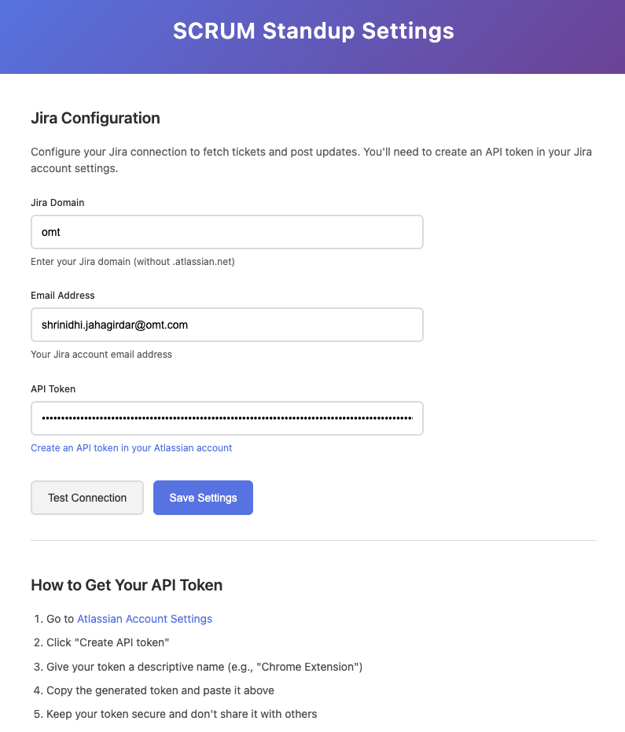
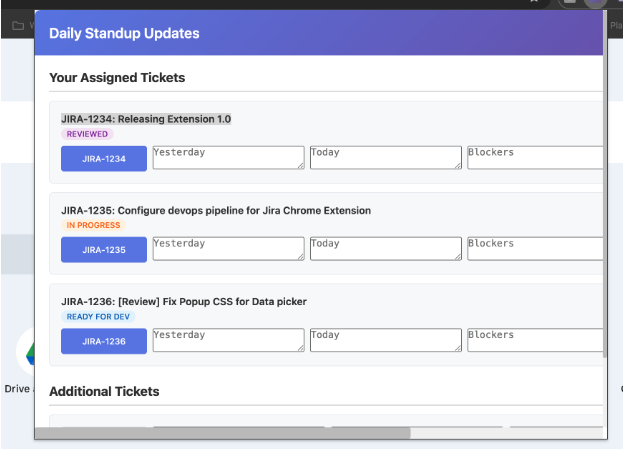

# SCRUM Daily Standup Chrome Extension for Jira Cloud

A Chrome extension designed to facilitate daily standup meetings for SCRUM teams. This extension helps team members quickly share their updates by integrating directly with Jira tickets.

## Features

- **Automatic Ticket Fetching**: Automatically loads your assigned Jira tickets with their current status
- **Structured Updates**: Provides fields for "Yesterday", "Today", "Blockers", and "Completion Date"
- **Batch Submission**: Submit updates for multiple tickets at once or individually
- **Update History**: View your previous standup updates for reference
- **Secure Authentication**: Uses Jira API tokens stored securely in Chrome's storage
- **Responsive Design**: Works seamlessly across different screen sizes

## Installation

### Development Installation

1. Clone this repository
2. Open Chrome and navigate to `chrome://extensions/`
3. Enable "Developer mode" in the top right corner
4. Click "Load unpacked" and select the extension directory
5. The extension icon should appear in your Chrome toolbar

### Production Installation

*Coming soon to the Chrome Web Store*

## Setup

1. **Create a Jira API Token**:
   - Go to [Atlassian Account Settings](https://id.atlassian.com/manage-profile/security/api-tokens)
   - Click "Create API token"
   - Give it a name like "Chrome Extension"
   - Copy the generated token

2. **Configure the Extension**:
   - Click the extension icon in your Chrome toolbar
   - Click the settings (⚙️) button
   - Enter your:
     - Jira domain (e.g., "your-company" for your-company.atlassian.net)
     - Email address associated with your Jira account
     - API token you created above
   - Click "Test Connection" to verify your settings
   - Click "Save Settings"


   

## Usage

1. **Daily Standup Updates**:
   - Click the extension icon
   - Your assigned tickets will automatically load
   - Fill in the update fields for each ticket:
     - What you did yesterday
     - What you plan to do today
     - Any blockers you're facing
     - Planned completion date
   - Submit updates individually or all at once


   


2. **Additional Tickets**:
   - Use the "Additional Tickets" section for tickets not in your assignment
   - Click "Add Ticket" to add more entries
   - Enter the ticket number and your updates

3. **View History**:
   - Click "View History" to see your previous updates
   - History is stored locally and automatically cleaned up

## Update Format

Updates are posted to Jira tickets in this format:

```
Daily Standup Update:

Yesterday: [What was done yesterday]
Today: [What will be done today]
Blockers: [Any blockers faced]
Completion Date: [Planned completion date]
```

## Technical Details

- **Manifest Version**: 3 (latest Chrome extension standard)
- **Permissions**: Storage, Active Tab, Jira domain access
- **Storage**: Chrome's sync storage for settings, local storage for history
- **API**: Jira REST API v3
- **Security**: Basic authentication with API tokens

## File Structure

```
├── manifest.json          # Extension manifest
├── popup.html             # Main popup interface
├── popup.css              # Popup styling
├── popup.js               # Popup functionality
├── options.html           # Settings page
├── options.css            # Settings page styling
├── options.js             # Settings page functionality
├── background.js          # Background service worker
├── icons/                 # Extension icons
├── assets/                # Assets library
└── README.md              # This file
```

## Development

### Prerequisites

- Google Chrome (latest version)
- Text editor or IDE
- Basic knowledge of HTML, CSS, and JavaScript

### Making Changes

1. Make your changes to the source files
2. Go to `chrome://extensions/`
3. Click the refresh icon on the extension card
4. Test your changes by clicking the extension icon

### Debugging

- Use Chrome DevTools for debugging the popup and options pages
- Check the background service worker in `chrome://extensions/` by clicking "Inspect views: service worker"
- Monitor the console for any errors

## Privacy & Security

- All data is stored locally in your Chrome browser
- API credentials are stored securely using Chrome's sync storage
- No data is sent to external servers except direct communication with your Jira instance
- Update history is automatically cleaned up after 30 days

## Troubleshooting

### Common Issues

1. **"Configuration Required" message**:
   - Make sure you've configured your Jira settings in the options page
   - Test your connection to verify credentials

2. **"Failed to load tickets"**:
   - Check your internet connection
   - Verify your Jira domain is correct
   - Ensure your API token hasn't expired

3. **"Failed to submit update"**:
   - Make sure you have permission to comment on the ticket
   - Check that the ticket key is valid
   - Verify your API token has the necessary permissions

### Support

For issues and feature requests, please create an issue in this repository.

## Contributing

Contributions are welcome! Please read the contributing guidelines before submitting pull requests.

## License

This project is licensed under the MIT License - see the LICENSE file for details.

## Changelog

### Version 1.0.0
- Initial release
- Basic ticket fetching and update submission
- Settings configuration
- Update history tracking
- Responsive design
